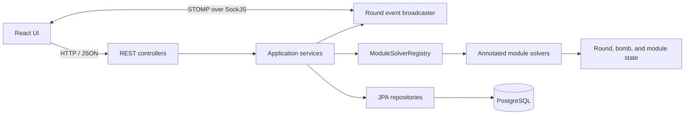
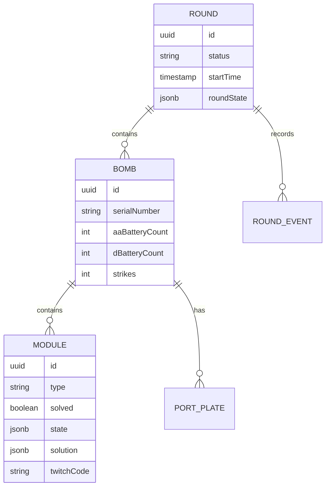

# Architecture

KTANESolver is a Spring Boot API and a React single-page application backed by PostgreSQL.

## Backend request flow

1. A controller receives and validates the HTTP request.
2. A service loads the round, bomb, and module inside a transaction.
3. `ModuleSolverRegistry` finds the solver registered for the module type.
4. The service converts the request map into the solver's typed input record.
5. The solver returns a `SolveSuccess` or `SolveFailure`.
6. Intermediate state and calculated solutions are stored in the module's JSONB fields.
7. After commit, round events are persisted and broadcast to connected clients.

Every solver annotated with both `@Service` and `@ModuleInfo` is discovered automatically. There is no manual backend registry switch.

## Domain model

`ModuleEntity.state` holds resumable, multi-stage progress. `ModuleEntity.solution` holds calculated output and the input that produced it. Physical completion remains a separate `solved` flag.

## Frontend state

The frontend has two shared Zustand stores:

| Store | Responsibility |
|---|---|
| `useCatalogStore` | Loads `/api/modules` once and indexes catalog metadata by module type |
| `useRoundStore` | Owns the current round, bomb, module, API mutations, and synchronization state |

`src/components/solvers/registry.ts` maps module types to lazy-loaded React components. The backend catalog controls names, categories, tags, and selector placement; the frontend registry controls whether a custom solver UI exists.

## Realtime updates

The backend exposes a SockJS endpoint at `/ws` and uses the STOMP topic `/topic/rounds/{roundId}`.

Persisted events include module updates, module solves, and round strikes. Broader setup changes publish a `ROUND_UPDATED` message. Clients refresh authoritative round state after receiving relevant events instead of trying to reproduce server mutations locally.

## Source map

| Area | Location |
|---|---|
| Controllers | `src/main/java/ktanesolver/controller/` |
| Services | `src/main/java/ktanesolver/service/` |
| Solver framework | `src/main/java/ktanesolver/logic/` |
| Vanilla solvers | `src/main/java/ktanesolver/module/vanilla/` |
| Modded solvers | `src/main/java/ktanesolver/module/modded/` |
| Entities | `src/main/java/ktanesolver/entity/` |
| Flyway migrations | `src/main/resources/db/migration/` |
| Frontend pages | `ktanesolver-frontend/src/pages/` |
| Solver components | `ktanesolver-frontend/src/components/solvers/` |
| Frontend services | `ktanesolver-frontend/src/services/` |
