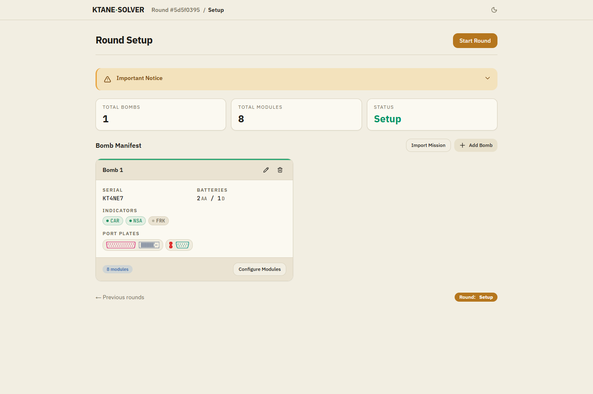
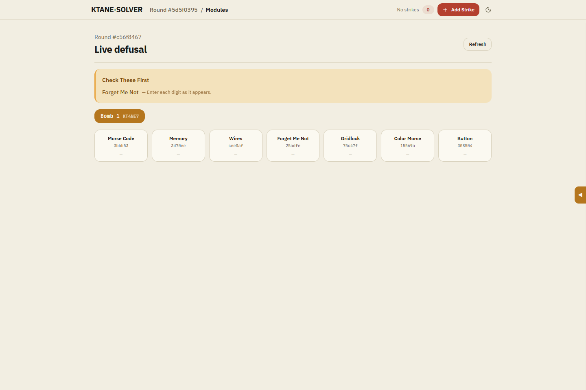
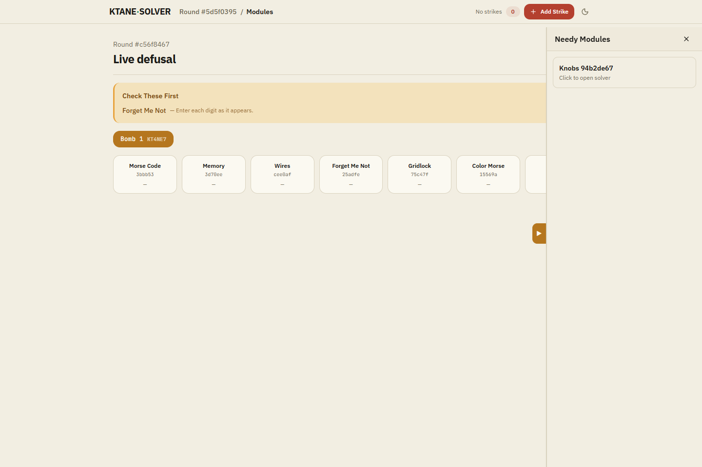
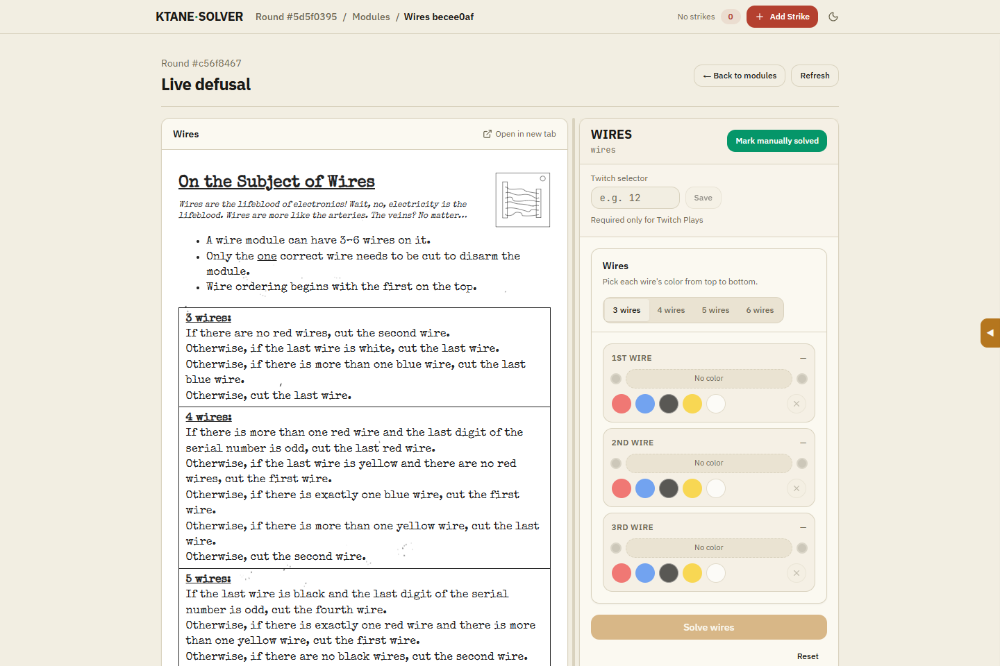
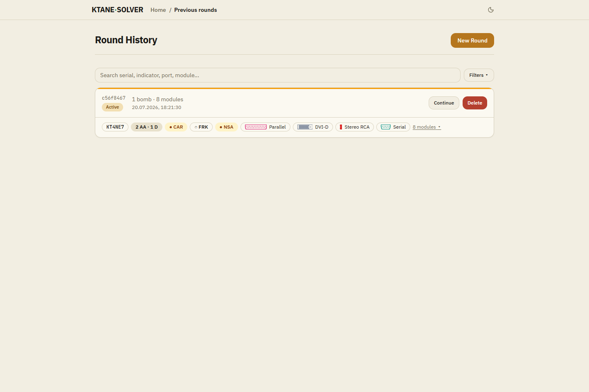

# Visual tour

KTANESolver keeps bomb setup, module selection, manuals, and solver controls in one workspace. This tour follows a round from setup to resuming it later.

## 1. Configure a round

Create the round, enter each bomb's edgework, and add the modules you expect to solve. The setup summary keeps the serial number, batteries, indicators, ports, and module count visible before the timer starts.

## 2. Start live defusal

During a round, every module appears in the live grid with its current status. The **Check These First** area brings useful early modules to the top of the workspace.

## 3. Keep needy modules visible

Open the needy-module drawer without leaving the regular module grid. This makes it easier to react to recurring modules while continuing the main solve.

## 4. Work beside the manual

Selecting a module opens its solver beside the matching manual. Enter the observed state, submit it, and keep the instructions in view throughout the solve.

## 5. Resume from round history

Previous rounds retain their bombs, edgework, modules, and progress. Search the history and continue an active round without rebuilding its setup.

Ready to try it? Continue with [Use KTANESolver](using-ktanesolver.md).
